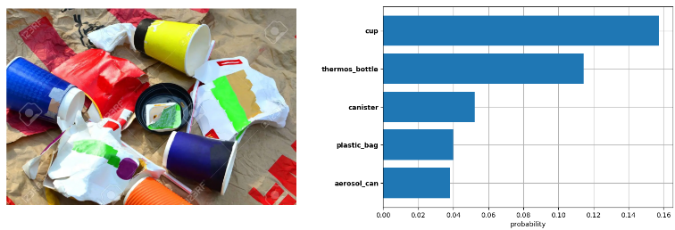
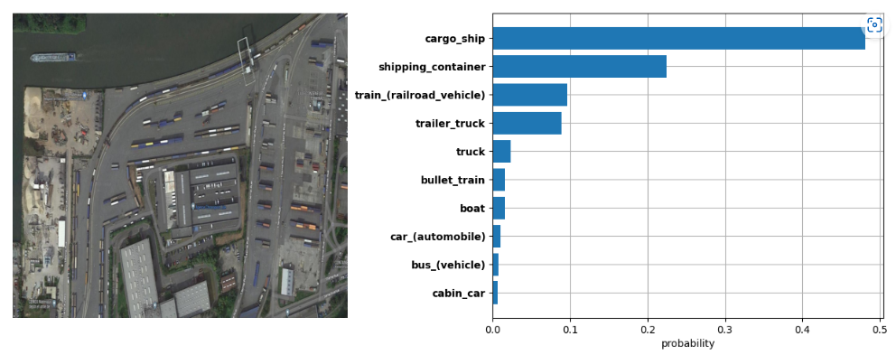
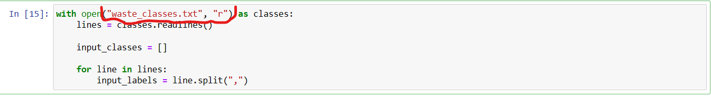
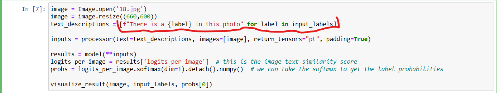

# Zero-Shot-Image-Classification

## Outputs
<p align="center"></p>
<p align="center"></p>

## Guide
Clone this repo

cd into cloned repo

Create a Virtual environment.

```
pip install virtualenv
python -m venv zero-shot
```

Activate Virtual environment

```
 ./zero-shot/source/activate
```

Install requirements

```
pip install -r openvino_requirements.txt
```
Open jupyter notebook and read classes from appropriate .txt file i.e "waste_classes.txt" for waste image clasification and "aerial_classes" for aerial image classification. Modify classes if needed.
<p align="center"></p>

Edit text description to most suitable description
<p align="center"></p>
